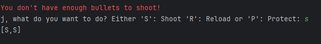
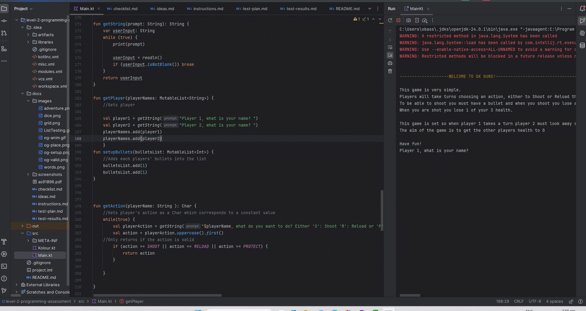
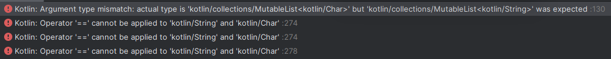
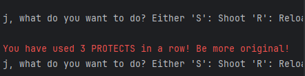

# Results of Testing

The test results show the actual outcome of the testing, following the [Test Plan](test-plan.md)

---

## Game Setup + All lists (playerNames, playerBullets, playerActions, playerActionNames, playerHealths)

All lists should contain their respected items and be the right type (playerActions is a Char and playerBullets is an Int). The player's should input their name and action and the code should store that information. The bullets should start at 1 each and contain both players bullets. This is the same for the lists of the players' healths and actions too.

### Test Data Used

I will run the code multiple times to test if they contain the right contents and clear when wanted to and don't include/allow any illegal inputs

### Test Result

All lists do their respective functions. It asks for the players names and uses them throughout. The bullet number of the players goes up when reloading and down when shooting. It also clears the lists after the round is over. Each player's healths also go down when being shot successfully. 

I had to fix an error where the player would press shoot even though they did not have any bullets, and it would still save their shooting as their action. To fix that I had to take the add action out of my function and put it after the bullet check. 
Here you can see that by printing out the list it still added the S(SHOOT) even though it was invalid.

---

## Player's taking turns and finishing rounds

Player's take 1 turn each to choose their action. Then, the aftermath of how those actions collide after they choose.

### Test Data Used

I put the players' turns are in a for loop of (0, 1) (Player 1 and 2) which loops back around when it is the second player's turn and ends once each player has had their turn

### Test Result

When taking a turn the first text you see tells the other player to look away, so you can do your action without them seeing. It will then ask for the player's action. The player cannot input an illegal action, shooting without a bullet will give the user a warning message saying they do not have enough bullets and will make the user have to input another action instead. Also putting an illegal character that isn't s, r or p will make the user retake their action. When the player successfully does their turn it will ask them to type anything in which prints a massive gap so the other player cannot see their action, and now it is the other player's turn. When that player finishes their turn it goes to the aftermath section of the game.
When the aftermath is over and all players have read what happened and the game continues onto the next round it will ask for a player to input a random character in order to move onto the next round. This is so it won't start the next round until both players have read what happened. 
I had to create a function for this as before it would just gone onto the next round and made a massive gap which made the players have to painfully scroll back up to read the aftermath.

---

## Player's winning and showing aftermath

When one or the other players health is 0, the game ends and the other player should win. Depending on the combination of actions, what the aftermath shows/returns as should be different

## Test Data Used

The player should be able to break out of the loop by winning and not be stuck in a forever loop. I also tested to see how the health dwindles as actions happen. I also tested every combination of aftermath to see if it showed the correct text.

### Test Result

When taking a turn the character of your action (S,P or R) is recorded in the playerActions list. In the showAftermath function it takes both of the values of the list and returns the result of those two actions. This gif shows every single possible combination and shows they all work as intended. It also shows that when one of the players health hits zero it breaks out of the game loop, congratulates the player and ends the game.

I had an issue where playerActions and playerNameActions which are both different lists. (One is used to determine what happens in aftermath because of the two choices. eg: Nothing happens(Because they both protected) and playerActionNames which shows which each player chose (P1 chose to SHOOT and P2 chose to PROTECT.) were both pulled as a STRING list even though the names one is a list of CHAR. 

---

## Limit Testing

While play testing I found out that a player can continue clicking PROTECT with no actual consequence. This means that the game could be soft locked by that player continuously clicking PROTECT and the game cannot end as PROTECT had no drawback. So I coded a limit on the number of protects you are allowed to do in succession. This change should make games more strategic on how PROTECTS are used, and it prevents that soft lock.
