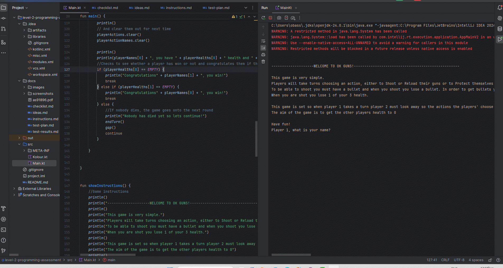

# Results of Testing

The test results show the actual outcome of the testing, following the [Test Plan](test-plan.md)

---

## Game Setup + All lists (playerNames, playerBullets, playerActions, playerActionNames, playerHealths)

All lists should contain their respected items and be the right type (playerActions is a Char and playerBullets is an Int). The player's should input their name and action and the code should store that information. The bullets should start at 1 and the list should contain both players bullets, healths and eventual actions, action names.

### Test Data Used

I will run the code multiple times to test if they contain the right contents and clear when wanted to and don't include/allow any illegal inputs

### Test Result

All lists do their respective functions. It asks for the players names and uses them throughout. The bullet number of the players goes up when reloading and down when shooting and they are separate variables. When it asks for the player's action, the player cannot do an illegal action, such as shooting without a bullet will make the user have to input another action, and it does not add the illegal character to the list. (Also it does not let you put an illegal character (not s, r, p.) either) It also clears the lists after the round is over. Each player's healths also go down when being shot successfully, separately.

---

## Example Test Name

Example test description. Example test description.Example test description. Example test description.Example test description. Example test description.

### Test Data Used

Details of test data. Details of test data. Details of test data. Details of test data. Details of test data. Details of test data. Details of test data.

### Test Result

Comment on test result. Comment on test result. Comment on test result. Comment on test result. Comment on test result. Comment on test result.

---

